# Project: Advanced Lane Finding

### Project Structure
Overview of the different files submitted in the project

1. **`project.ipynb`**: IPython notebook which houses all the code
2. **`outputs`**: A folder containing the different stages of a test image as it moves through the project pipeline.
3. **`report.md`**: Project report

### Discussion
##### Camera Calibration
I used Udacity's set of chessboard images to calibrate the camera and prepare the undistort matrix. Here's the final output of an undistorted chessboard image:
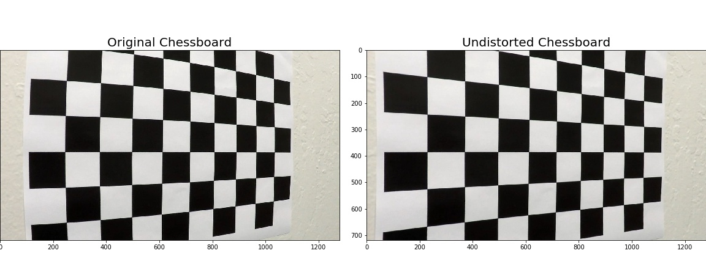 

##### Distortion-corrected road images
Created a `undistort()` function for correcting images:
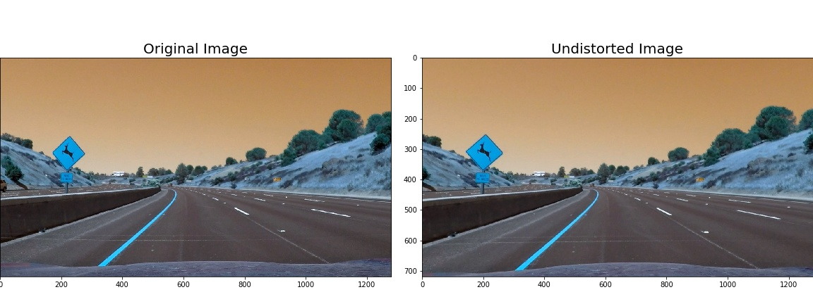 

##### Detecting Lanes in Images
My final pipeline included the following:
* Convert image into HLS color space
* Extract saturation channel
* Take x-gradient of saturation channel, scale and threshold it
* Threshold the saturation channel
* Combine saturation and gradient thresholds to create a single-channel binary image

Here are the thresholded images:
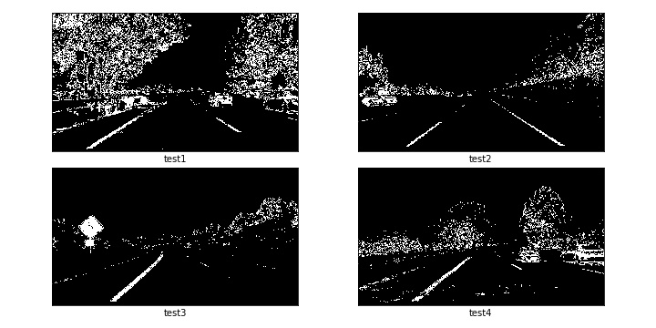 

##### Finding a region of interest
It was important to clearly demarcate the region in which the program should look for lane lines. Therefore, I defined a set of coordinates and created the `region_of_interest()` function to black out irrelevant details out of the input images.
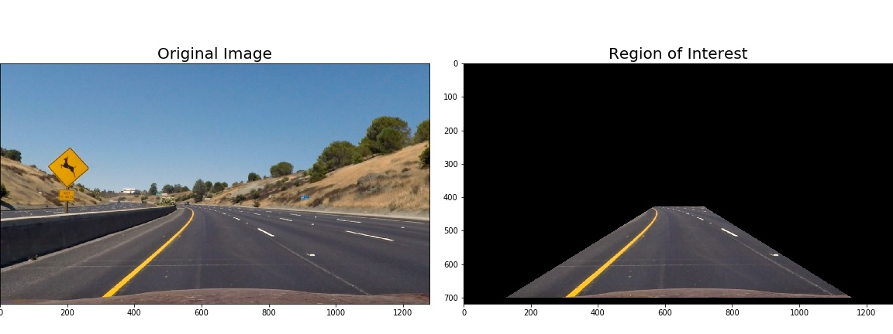

##### Applying a perspective transform
After this I used the following coordinates to define my `warp()` function:
| Source        | Destination   | 
|:-------------:|:-------------:| 
| 544, 470      | 256, 128        | 
| 736, 470      | 1024, 128      |
| 128, 700     | 256, 720      |
| 1152, 700      | 1024, 720        |

Here is a test of the warped images
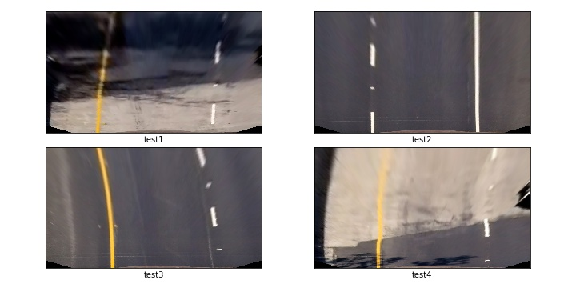

##### And here is a sample warped binary image
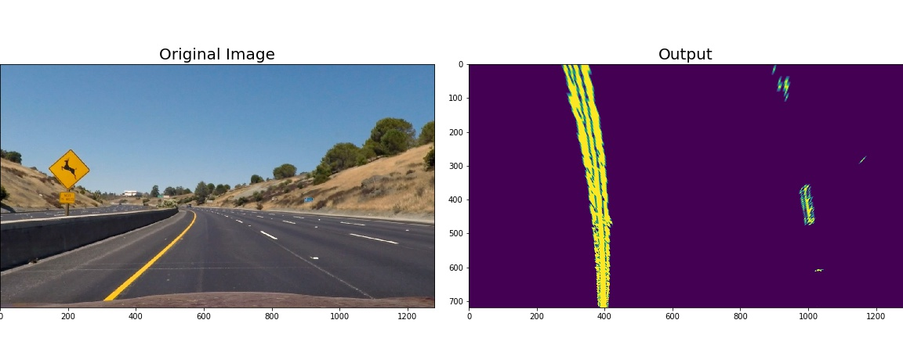

##### Finding base lanes using a histogram
As taught in the class, I plotted a histogram to see where where the maximum lane pixels in the images. In most test images the results I used, the results were clear enough:

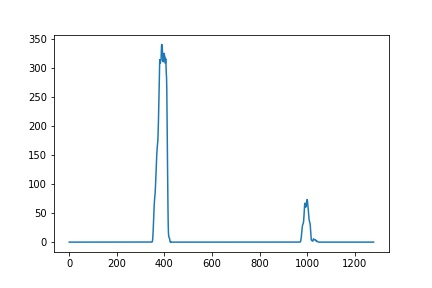

##### Finding the lane line equations
Here's the summary of all the steps taken for extracting lane equations:
1. Take warped binary image of road
2. Find peaks in the histogram and use `np.argmax()` for getting the x-coordinates
3. Store the coordinates as base lane positions
4. Create empty lists to hold the individual pixel coordinates: *left_lane_inds* and *right_lane_inds*.
5. Split the image into windows. In each window, create boxes around the lane areas using a self-decided *margin*. These boxes will be the area in which we will look for non-zero lane pixel values, and then add those pixel coordinates to the lists defined above (left_lane_inds and right_lane_inds).
6. Use `np.polyfit` to fit a 2-degree polynomial around the lane pixels for each lane.
7. Save the polynomial equations in global variables so that they are available to the next frame of video. This is to allow for smooth transitions and error-handling.

Here's what the line equations look like when plotted:

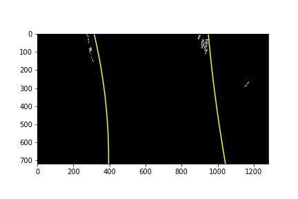

For the next frame:

8. Directly use the previous line equations to draw the regions where we will look for lane pixels.

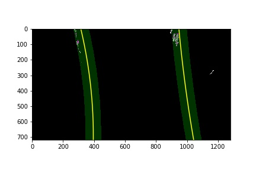

9. Fit a polynomial again and save globally.

##### Marking lanes on road image
We can now use `cv2.fillPoly` to paint the lane interiors. After that we use reverse perspective transform to get the original image having lanes marked on it.
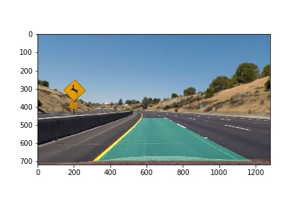

##### Finding radius of curvature
We use the previously discovered polynomials in pixel space to find new polynomials in world-space, and then apply the formula for radius of curvature. I used the formula provided by Udacity. However, instead of finding curvature at the bottom of the image, I find it for the center of the lane lines.

##### Vehicle position with respect to center
For this, we simply find the mid-point of the two lanes' bottom x-coordinates, and compare that with the midpoint of our image. This of course assumes that the camera is at the center of the car. With this calculation we easily find the displacement from lane-center.

##### Final image output
I used `cv2.putText()` for writing the Radius and Vehicle Position values over our image, and here is the final output:
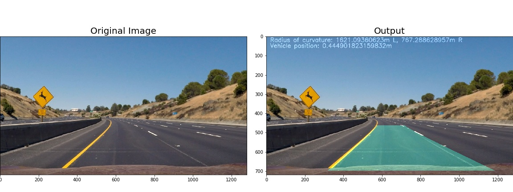

### Project Video Link
Please watch it [here](https://youtu.be/1BnR208cy7Q)!